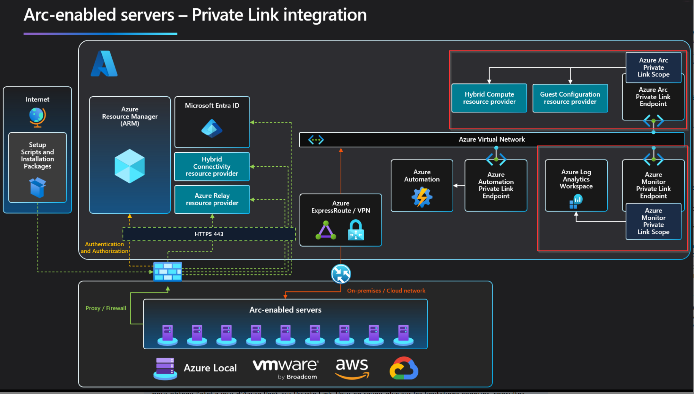

# Azure Arc + AMPLS Sandbox (Full Private Link)

This repository provides a complete sandbox environment to explore **Azure Arc** and **Azure Monitor Private Link Scope (AMPLS)** in a **fully private setup using Azure Private Link**.

Everything is deployed and configured **automatically via Terraform** — no manual scripts, no VM login required for onboarding.

> ℹ️ This project is inspired by the community work from [Azure Arc Jumpstart](https://github.com/microsoft/azure_arc).  
> The Terraform code has been built to deploy a fully private environment integrating Azure Arc, AMPLS, and Private Link.

## 🎯 Purpose

The goal is to understand and test:

- Hybrid machine onboarding with **Azure Arc** via **Private Link**
- How **AMPLS** (Azure Monitor Private Link Scope) works in a private network
- DNS resolution via **Private DNS Zones**
- Automated monitoring with **Azure Monitor Agent (AMA)** and **Data Collection Rules (DCR)**



> ⚠️ This environment is intended for **testing and learning purposes only**. It **must not be used in production**.

## 📦 Architecture Overview

| Component | Description |
|-----------|-------------|
| **VNet OnPrem** (10.10.0.0/16) | Simulated on-premises network |
| **VNet Azure** (10.20.0.0/16) | Azure cloud network |
| **VNet Peering** | Connectivity between OnPrem and Azure |
| **Windows Server 2025** | Simulated on-prem VM with Arc Agent + AMA |
| **Azure Bastion** | Secure management access (RDP) |
| **Arc Private Link Scope** | Private connectivity for Arc onboarding |
| **AMPLS** | Private connectivity for Azure Monitor |
| **Private DNS Zones** | Private name resolution for all endpoints |
| **Log Analytics Workspace** | Centralized log storage |
| **DCR** | Perf counters (CPU, Memory, Disk) + Windows Events |

### Traffic Flow
```
VM (10.10.x.x) → VNet Peering → Private Endpoints (10.20.1.x) → Arc PLS / AMPLS → Log Analytics
```

**Zero internet exposure** — all traffic flows through Private Link endpoints.

## 📁 Repository Structure
```
.
├── main.tf                    # Root module - orchestration
├── variables.tf               # Root variables
├── outputs.tf                 # Root outputs
├── providers.tf               # Provider configuration
├── terraform.tfvars.example   # Example configuration (copy and fill)
└── modules/
    ├── networking/            # VNets, Peering, NSG, Private Endpoints, DNS Zones
    │   ├── main.tf
    │   ├── variables.tf
    │   └── outputs.tf
    ├── compute/               # VM, Bastion, Arc onboarding, AMA extension
    │   ├── main.tf
    │   ├── arc_monitoring.tf
    │   ├── variables.tf
    │   └── outputs.tf
    └── monitoring/            # Log Analytics, AMPLS, DCE, DCR, DNS Zones
        ├── main.tf
        ├── variables.tf
        └── outputs.tf
```

## ✅ Prerequisites

- [Azure CLI](https://learn.microsoft.com/en-us/cli/azure/install-azure-cli) installed
- [Terraform](https://developer.hashicorp.com/terraform/downloads) >= 1.5.0
- A **Service Principal** with `Contributor` role on a subscription

## 🔧 Setup

### 1. Clone the repository
```bash
git clone https://github.com/technicalandcloud/Azure_Arc_PrivateLink_AMPLS.git
cd Azure_Arc_PrivateLink_AMPLS
```

### 2. Create a Service Principal
```powershell
az login

$subId = az account show --query id -o tsv

az ad sp create-for-rbac `
    --name "arc-lab-sp" `
    --role "Contributor" `
    --scopes "/subscriptions/$subId"
```

Note the `appId`, `password`, and `tenant` from the output.

### 3. Configure Terraform variables
```bash
cp terraform.tfvars.example terraform.tfvars
```

Edit `terraform.tfvars` with your values:
```hcl
project_name      = "arc-lab"
environment       = "dev"
location          = "francecentral"

tenant_id         = "<YOUR_TENANT_ID>"
subscription_id   = "<YOUR_SUBSCRIPTION_ID>"
arc_client_id     = "<YOUR_SP_CLIENT_ID>"
arc_client_secret = "<YOUR_SP_CLIENT_SECRET>"

vm_admin_username = "arcadmin"
vm_admin_password = ""  # Leave empty for auto-generation

enable_vpn_gateway = false
enable_ampls       = true
```

## 🚀 Deployment
```bash
terraform init
terraform apply -auto-approve
```

That's it. Terraform will automatically:

1. ✅ Create 3 resource groups (onprem, azure, monitor)
2. ✅ Deploy VNets with Peering
3. ✅ Configure NSG and Private DNS Zones
4. ✅ Deploy a Windows Server 2025 VM with Azure Bastion
5. ✅ Install Azure CLI on the VM
6. ✅ Block IMDS (so the VM behaves as true on-prem)
7. ✅ Configure hosts file for Arc Private Link resolution
8. ✅ Download and install the Arc Connected Machine Agent
9. ✅ Onboard the VM to Azure Arc via Private Link
10. ✅ Create Log Analytics Workspace, AMPLS, DCE, and DCR
11. ✅ Install Azure Monitor Agent (AMA) via Arc extension
12. ✅ Associate DCR and DCE to the Arc machine

**No manual VM login required. No external scripts.**

## ✔️ Post-Deployment Verification

### Via Azure Bastion (connect to the VM)

**Verify Arc Agent status:**
```powershell
& "$env:ProgramW6432\AzureConnectedMachineAgent\azcmagent.exe" show
# Expected: Agent Status = Connected

& "$env:ProgramW6432\AzureConnectedMachineAgent\azcmagent.exe" check -p
# Expected: All endpoints Reachable = true, Private = true
```

**Verify Private Link DNS resolution:**
```powershell
Resolve-DnsName "<WORKSPACE_ID>.ods.opinsights.azure.com"
Resolve-DnsName "<WORKSPACE_ID>.oms.opinsights.azure.com"
# Expected: resolves to private IPs (10.20.1.x)
```

### Via Azure Portal

- **Azure Arc > Servers** → VM status = `Connected`
- **Arc > VM > Extensions** → `AzureMonitorWindowsAgent` = `Succeeded`
- **Monitor > Private Link Scopes** → AMPLS with LAW and DCE linked
- **Monitor > Data Collection Rules** → DCR with Arc machine associated
- **Private DNS Zones** → Records resolving to private IPs

### Via Log Analytics (KQL queries)
```kql
-- Heartbeat
Heartbeat | where TimeGenerated > ago(30m) | project TimeGenerated, Computer, OSType

-- CPU usage
Perf
| where ObjectName == "Processor" and CounterName == "% Processor Time"
| where TimeGenerated > ago(30m)
| summarize AvgCPU = avg(CounterValue) by bin(TimeGenerated, 1m)
| render timechart

-- Memory
Perf
| where ObjectName == "Memory" and CounterName == "Available MBytes"
| where TimeGenerated > ago(30m)
| summarize avg(CounterValue) by bin(TimeGenerated, 1m)
| render timechart

-- Windows Events
Event
| where TimeGenerated > ago(1h)
| summarize count() by EventLevelName, Source
| render piechart
```

## 🔐 Proving Full Private Link

| Check | Expected Result |
|-------|----------------|
| `azcmagent check -p` | All endpoints `Private = true` |
| `Resolve-DnsName *.ods.opinsights.azure.com` | IP = `10.20.1.x` |
| `Resolve-DnsName *.oms.opinsights.azure.com` | IP = `10.20.1.x` |
| `Test-NetConnection *.ods.opinsights.azure.com -Port 443` | `RemoteAddress = 10.20.1.x`, `TcpTestSucceeded = True` |
| DCE in portal | `Public network access = Disabled` |
| AMPLS in portal | LAW + DCE linked, PE = `Approved` |
| IMDS request | Timeout (blocked by firewall rule) |

## 🧹 Cleanup
```bash
terraform destroy -auto-approve
```

If the destroy hangs on Arc extensions:
```bash
# Delete the Arc machine manually
az resource delete \
  --ids "/subscriptions/<SUB_ID>/resourceGroups/<RG>/providers/Microsoft.HybridCompute/machines/<VM_NAME>"

# Or delete all resource groups
az group delete --name arc-lab-dev-onprem-rg --yes --no-wait
az group delete --name arc-lab-dev-azure-rg --yes --no-wait
az group delete --name arc-lab-dev-monitor-rg --yes --no-wait

# Clean Terraform state
rm -rf .terraform/ terraform.tfstate*
```

## 📝 Configuration Options

| Variable | Default | Description |
|----------|---------|-------------|
| `project_name` | `arc-lab` | Project name prefix |
| `environment` | `dev` | Environment (dev, staging, prod) |
| `location` | `francecentral` | Azure region |
| `vm_size` | `Standard_D2s_v3` | VM size |
| `vm_admin_password` | `""` (auto) | VM password (empty = auto-generated) |
| `enable_vpn_gateway` | `false` | Use VPN Gateway instead of Peering |
| `enable_ampls` | `true` | Deploy AMPLS + monitoring stack |
| `log_retention_days` | `30` | Log retention in days |

## 📄 License

This project is for educational purposes. See [LICENSE](LICENSE) for details.